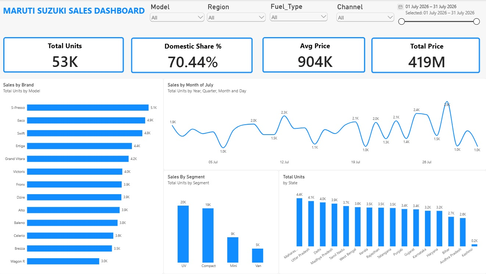

# Maruti Suzuki Sales Dashboard

A data analytics capstone project focused on Maruti Suzuki sales performance, combining SQL-based data preparation and Power BI dashboard reporting.

## Overview

This project analyzes sales patterns across vehicle models, regions, fuel types, transmission types, and sales channels. It turns raw sales records into a clean, structured dataset and presents actionable insights through an interactive dashboard.

The goal is to support business decision-making by identifying:

- best-selling vehicle models
- strongest sales states and cities
- segment-wise and channel-wise performance
- fuel and transmission preferences
- pricing and sales-volume trends

## Dashboard Preview

  

## Sales Map Preview

  

## Project Highlights

- Data cleaning and validation using MySQL
- Duplicate removal and null handling
- Standardization of model and fuel-type values
- Sales trend and regional performance analysis
- Power BI dashboard for executive reporting

## Dataset

The project uses sales records containing the following fields:

- Sale_Date
- Model
- Segment
- Fuel_Type
- Transmission
- State
- Dealer_City
- Channel
- Units_Sold
- Ex_Showroom_Price
- Prev_Year_Units

## Data Cleaning Workflow

The SQL script performs the key transformations required for analysis:

- creates the sales database and raw table
- checks duplicate records
- identifies missing or invalid values
- trims and standardizes text fields
- converts dates into proper SQL date format
- removes invalid rows with missing unit sales
- fills missing transmission values
- creates a distinct cleaned dataset for reporting

## Business Questions Addressed

- Which Maruti Suzuki models sell the most?
- Which states and cities contribute highest volume?
- What is the impact of fuel type and transmission on sales?
- How does ex-showroom price relate to sales performance?
- Which sales channels are most productive?
- How do current sales compare with previous-year volume?

## Tools and Technologies

- SQL / MySQL
- Power BI
- CSV data files
- Data cleaning and transformation workflows

## Project Files

- `Maruti_Clean_Data.csv` — cleaned dataset used for analysis
- `Maruti_Sales_Raw_Sample.csv` — raw source dataset
- `Maruti_Suzuki_Sales_DB.sql` — SQL cleaning and transformation script
- `Maruti Suzuki Sales Dashboard.pbix` — Power BI dashboard file
- `Maruti_Sales_Dashboard_Capstone_Plan.pdf` — project planning document
- `Screenshots.jpg` — main sales dashboard screenshot
- `Screenshots 2.jpg` — regional/map view screenshot

## How to Use

1. Open the SQL script in MySQL Workbench.
2. Right Click to import the CSV on this new Database
3. Run the database and cleaning queries.
4. Review the cleaned dataset for consistency.
5. Import the cleaned data into Power BI.
6. Open the dashboard file to explore visual insights.

## Future Enhancements

- monthly revenue and margin analysis
- sales forecasting model
- dealership-level performance comparison
- executive KPI summary dashboard
- integration with live sales data sources

## Conclusion

This project demonstrates a complete business intelligence workflow: dataset preparation, structured SQL cleaning, analytical insight generation, and dashboard storytelling for Maruti Suzuki sales performance.

---

  <strong>Capstone Project • Maruti Suzuki Sales Dashboard</strong>

